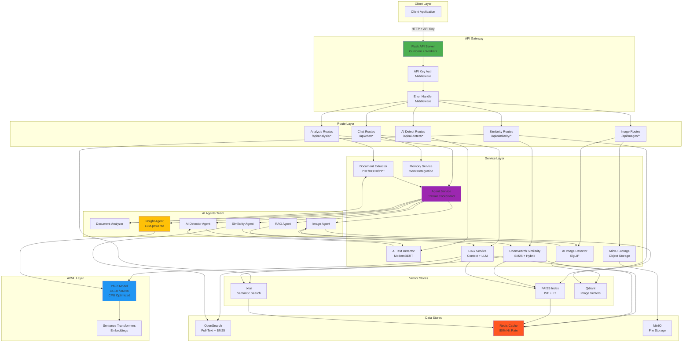
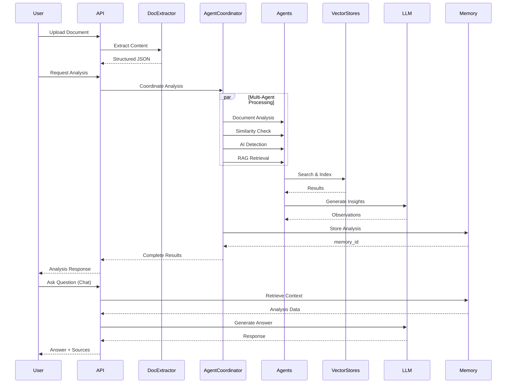

# 📊 INTELLIGENT ANALYSIS SYSTEM - ARCHITECTURE & ANALYSIS

## 🏛️ ARCHITECTURE DIAGRAM

---

## 🎯 SYSTEM FLOW DIAGRAM

---

## ✅ PROS DEL SISTEMA

### 🎨 Arquitectura y Diseño
1. **Modular y Escalable**: Separación clara de responsabilidades (routes, services, utils, middleware)
2. **Microservicios Ready**: Cada componente puede ser extraído a un microservicio independiente
3. **Patrón Factory**: Uso de `create_app()` permite múltiples configuraciones
4. **Blueprints organizados**: Endpoints agrupados lógicamente por funcionalidad
5. **Middleware centralizado**: Auth y error handling reutilizables

### 🚀 Performance
6. **Redis Caching**: Sistema de caché inteligente con decoradores
7. **Optimización CPU**: Todo diseñado para CPU-only (ONNX, GGUF quantization)
8. **Batch Processing**: Soporte para procesamiento en lotes (texto e imágenes)
9. **Connection Pooling**: Gestión eficiente de conexiones a bases de datos
10. **IVF Indexing**: FAISS con índices IVF para búsquedas rápidas

### 🔒 Seguridad
11. **API Key Authentication**: Sistema de autenticación simple pero efectivo
12. **Input Validation**: Decoradores para validación de JSON y archivos
13. **File Type Restrictions**: Whitelist de extensiones permitidas
14. **Size Limits**: Protección contra uploads masivos
15. **Error Handling**: Gestión centralizada de errores sin exponer internals

### 🧠 Inteligencia Artificial
16. **Multi-Model Support**: ModernBERT, Phi-3, SigLIP, Sentence Transformers
17. **Hybrid Search**: Combina BM25 + embeddings para mejor precisión
18. **RAG Implementation**: Sistema RAG completo con contexto y generación
19. **AI Agents Coordination**: CrewAI para orquestación de múltiples agentes
20. **Memory System**: Persistencia de análisis con mem0

### 📊 Bases de Datos
21. **Multi-Store Architecture**: FAISS + OpenSearch + Qdrant + txtai
22. **Specialized Storage**: Cada vector store optimizado para su caso de uso
23. **Document Mapping**: Sistema de mapeo para rastrear documentos
24. **Deduplication**: Lógica para evitar duplicados en resultados

### 🛠️ DevOps y Deployment
25. **Docker Compose**: Stack completo orquestado
26. **Multi-stage Builds**: Dockerfile optimizado para producción
27. **Health Checks**: Endpoints de salud para monitoring
28. **Environment Config**: Gestión robusta de configuración por entornos
29. **Volume Persistence**: Datos persistentes correctamente montados

### 📝 Código y Mantenibilidad
30. **Type Hints**: Uso de typing para mejor documentación
31. **Logging Comprehensivo**: Logs estructurados en todos los servicios
32. **Docstrings**: Documentación inline en todas las funciones importantes
33. **Utils Reutilizables**: Helpers comunes centralizados
34. **Response Formatting**: Respuestas API estandarizadas

### 🔧 Funcionalidades
35. **Document Extraction**: Soporte multi-formato (PDF, DOCX, PPTX, etc.)
36. **AI Text Detection**: Detección sofisticada con ensemble de modelos
37. **Image Similarity**: Búsqueda visual con embeddings
38. **Post-Analysis Chat**: Sistema de Q&A contextual
39. **Batch Operations**: APIs para procesamiento masivo
40. **Comprehensive Analysis**: Pipeline completo de análisis en una llamada

---

## 🚀 POSIBLES MEJORAS

### Nivel 1 - Alta Prioridad (Implementar en 1-2 semanas)

#### Performance
1. **Async Operations**: Migrar a Flask + async/await para I/O no bloqueante
2. **Celery Integration**: Queue system para análisis largos con workers
3. **Connection Pooling Mejorado**: SQLAlchemy o asyncpg para PostgreSQL
4. **Compression**: Compresión gzip para responses grandes
5. **CDN Integration**: Para servir modelos y assets estáticos

#### Funcionalidad
6. **Real-time Updates**: WebSocket para progreso de análisis en tiempo real
7. **Streaming Responses**: Server-Sent Events para chat responses
8. **Batch Queue Management**: Sistema de cola visible para el usuario
9. **Analysis Templates**: Plantillas predefinidas de análisis
10. **Export Formats**: Exportar resultados a PDF, XLSX, JSON

#### Seguridad
11. **JWT Authentication**: Migrar de API keys a JWT tokens
12. **Rate Limiting per User**: Límites individualizados por usuario
13. **RBAC**: Role-Based Access Control para equipos
14. **Audit Logging**: Tracking completo de acciones
15. **Input Sanitization**: Más validación y sanitización de inputs

### Nivel 2 - Media Prioridad (Implementar en 1 mes)

#### AI/ML
16. **Model Versioning**: Sistema para manejar múltiples versiones de modelos
17. **A/B Testing**: Comparar performance de diferentes modelos
18. **Fine-tuning Pipeline**: Sistema automatizado para afinar modelos
19. **RAGAS Integration**: Métricas de calidad RAG automatizadas
20. **Prompt Management**: Sistema para gestionar y versionar prompts

#### Escalabilidad
21. **Horizontal Scaling**: Auto-scaling de workers
22. **Load Balancer**: Nginx o Traefik para distribuir carga
23. **Database Sharding**: Particionar OpenSearch/FAISS por tenant
24. **Multi-Region**: Deployment en múltiples regiones
25. **Read Replicas**: Réplicas de lectura para bases de datos

#### Monitoring
26. **Prometheus + Grafana**: Métricas detalladas del sistema
27. **Distributed Tracing**: Jaeger o Zipkin para trace requests
28. **Error Tracking**: Sentry integration
29. **Performance Profiling**: Py-spy o cProfile integration
30. **Cost Monitoring**: Tracking de costos de infraestructura

### Nivel 3 - Baja Prioridad (Implementar en 2-3 meses)

#### Features Avanzados
31. **Multi-tenant Support**: Sistema completo multi-inquilino
32. **Collaborative Features**: Análisis compartidos y comentarios
33. **Version Control**: Git-like versioning para documentos analizados
34. **Webhook System**: Notificaciones a sistemas externos
35. **Plugin Architecture**: Sistema de plugins para extensibilidad

#### UI/UX
36. **Admin Dashboard**: Panel de administración web
37. **Analytics Dashboard**: Visualizaciones de uso y métricas
38. **API Documentation**: Swagger UI interactivo
39. **SDK Libraries**: SDKs para Python, JavaScript, Go
40. **Mobile Apps**: Apps nativas iOS/Android

#### Integrations
41. **Google Drive API**: Importar documentos desde Drive
42. **Dropbox Integration**: Soporte para Dropbox
43. **Slack Bot**: Bot para análisis desde Slack
44. **MS Teams Integration**: Integración con Teams
45. **Zapier/Make**: Integraciones no-code

#### ML/AI Avanzado
46. **Custom Model Training**: UI para entrenar modelos propios
47. **Transfer Learning**: Adaptación de modelos a dominios específicos
48. **Ensemble Methods**: Combinar múltiples modelos para mejor accuracy
49. **Explainable AI**: Visualización de por qué el modelo decidió X
50. **Adversarial Testing**: Testing contra ataques adversarios

### Nivel 4 - Exploración Futura (3+ meses)

#### Innovación
51. **Blockchain Integration**: Prueba de autenticidad con blockchain
52. **Federated Learning**: Entrenamiento distribuido preservando privacidad
53. **Quantum-Ready**: Preparación para algoritmos cuánticos
54. **Edge Computing**: Deployment en edge devices
55. **AR/VR Integration**: Visualización de análisis en 3D

#### Arquitectura
56. **Event Sourcing**: Arquitectura basada en eventos
57. **CQRS Pattern**: Separar commands y queries
58. **GraphQL API**: Complementar REST con GraphQL
59. **gRPC Services**: Inter-service communication con gRPC
60. **Service Mesh**: Istio para gestión de microservicios

---

## 🎯 RECOMENDACIONES DE IMPLEMENTACIÓN

### Semana 1-2
- Implementar Celery para async tasks
- Agregar JWT authentication
- Setup Prometheus + Grafana básico
- Implementar rate limiting per user
- Agregar WebSocket para updates

### Mes 1
- Pipeline de fine-tuning
- RAGAS integration
- Admin dashboard básico
- Swagger documentation
- Horizontal scaling setup

### Mes 2-3
- Multi-tenant support
- Advanced analytics
- Plugin architecture
- Mobile apps (phase 1)
- Integration con servicios cloud

---

## 📈 MÉTRICAS DE ÉXITO

### Performance
- Response time < 2s para 95% de requests
- Cache hit rate > 80%
- Concurrent users: 100+
- Analysis throughput: 50+ docs/min

### Calidad
- RAG precision > 85%
- AI detection accuracy > 90%
- Image similarity recall > 80%
- System uptime > 99.5%

### Negocio
- User adoption rate > 70%
- Daily active users growth
- API usage growth
- Customer satisfaction > 4.5/5

---

**Documento generado**: November 2024  
**Sistema Version**: 1.0.0 MVP  
**Target Valuation**: $100M USD
